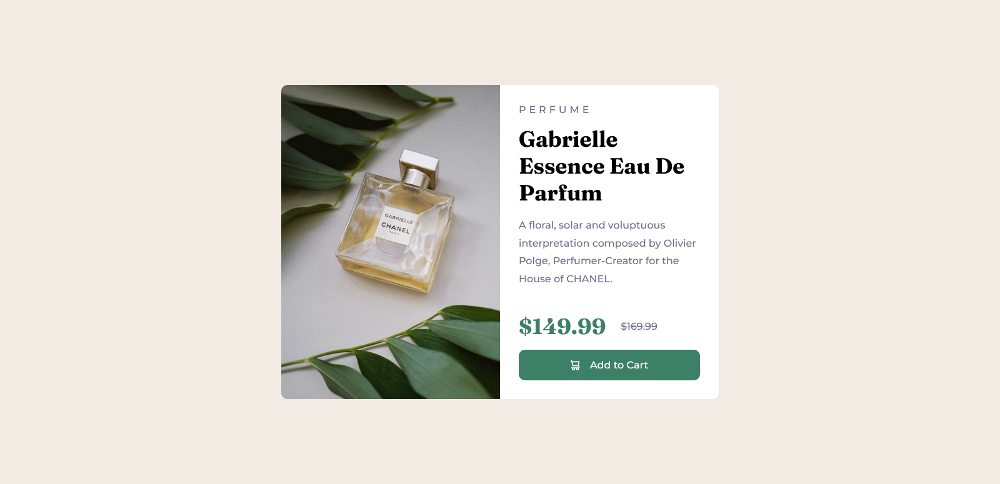
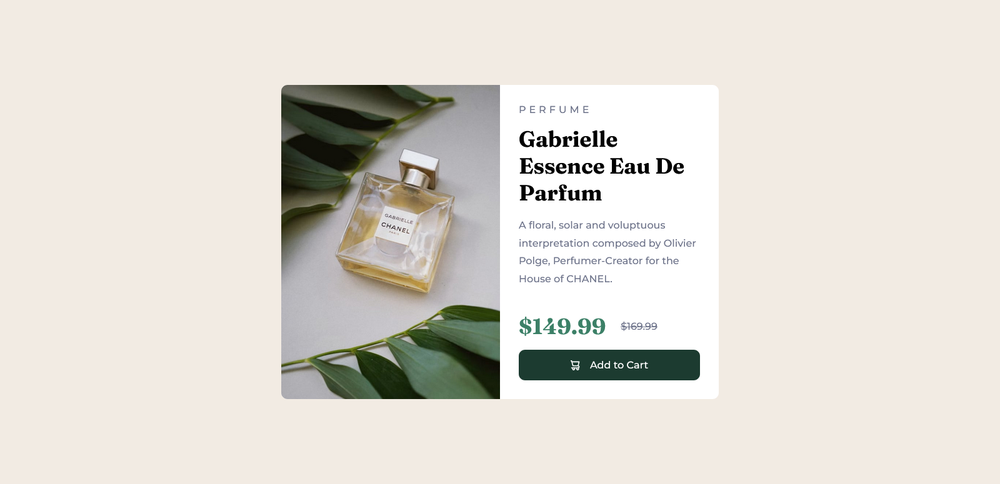

# Frontend Mentor - Product preview card component solution

This is a solution to the [Product preview card component challenge on Frontend Mentor](https://www.frontendmentor.io/challenges/product-preview-card-component-GO7UmttRfa). Frontend Mentor challenges help you improve your coding skills by building realistic projects.

## Table of contents

- [Overview](#overview)
  - [The challenge](#the-challenge)
  - [Screenshot](#screenshot)
  - [Links](#links)
- [My process](#my-process)
  - [Built with](#built-with)
  - [What I learned](#what-i-learned)
  - [Continued development](#continued-development)
  - [Useful resources](#useful-resources)
- [Author](#author)

## Overview

### The challenge

Users should be able to:

- View the optimal layout depending on their device's screen size
- See hover and focus states for interactive elements

### Screenshot

**Desktop View**


**Mobile View**


**Active View**


### Links

- Solution URL: [My Solution](https://github.com/cronomus01/product-preview-card)
- Live Site URL: [Live Site](https://cronomus01.github.io/product-preview-card/)

## My process

### Built with

- Semantic HTML5 markup
- CSS custom properties
- Flexbox
- CSS Grid
- Mobile-first workflow
- SASS

### What I learned

Use this section to recap over some of your major learnings while working through this project. Writing these out and providing code samples of areas you want to highlight is a great way to reinforce your own knowledge.

While working on this project i learned how sass works like variables functions and map i also learned mobile first workflow while doing this project

```css
Create Variable for the desktop

$desktop: 750px;

Create mixin and assign name to it then add the regular media query inside of the mixin and create @content inside;
@mixin desktop {
    @media (min-width: #{$desktop}) {
        @content;
    }
}
include inside the elements that you want to change to the mobile width to the desktop
body {
    main{
        width: max(30vw, 420px);
        @include desktop {
            width: max(30vw, 650px);
        }
    }
}
```

### Continued development

I want to focus on background images techniques to fit it on the container dynamically without setting up a specific pixel as i'm having a hard time doin it.

### Useful resources

- [Josh Reset CSS](https://www.joshwcomeau.com/css/custom-css-reset/) - This help me to setup my sass file before continuing to style the html
- [DesignCourse - Learn Sass in this Free Crash Course - Give your CSS Superpowers!](https://www.youtube.com/watch?v=roywYSEPSvc&list=PLNLc4ci5XNOYqDkYElIWITCRdfJaT6Fae&index=1) - This help me to use sass with this project as i want use sass to implement this project.

## Author

- Frontend Mentor - [@cronomus01](https://www.frontendmentor.io/profile/cronomus01)
